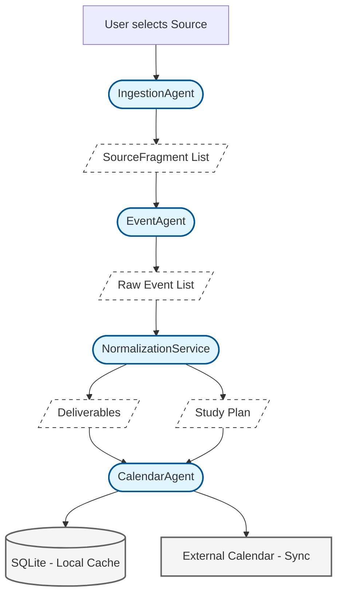

# Document-to-Event Conversion Pipeline

The application uses a multi-agent pipeline to transform unstructured academic documents into structured, actionable calendar events. This process is powered by specialized agents for extraction, analysis, and schedule management.

## Architectural Overview

## Phase Descriptions

### 1. Ingestion (`IngestionAgent`)
The `IngestionAgent` is responsible for the intelligent extraction of raw material. When a user selects a source, this agent manages the transition from binary data to structured text.
*   **Strategy Selection:** Automatically identifies the source type and selects the appropriate native reader.
*   **Structure Preservation:** Ensures that the resulting `SourceFragment` list maintains critical metadata such as page numbers and section hierarchy.

### 2. Event Generation (`EventAgent`)
The `EventAgent` acts as the primary intelligence for document analysis. It consumes the `SourceFragment` list and utilizes high-context reasoning to convert that text into structured event data:
*   **Deliverables:** Literal assignments and exams extracted from the text.
*   **Study Plan:** Proactive study periods generated by reasoning backwards from identified deadlines.

### 3. Post-Processing (`NormalizationService`)
The `NormalizationService` provides a programmatic safeguard to ensure data consistency and quality. It performs two critical functions:
*   **Category Normalization:** Standardizes event categories based on title keywords (e.g., ensuring "Final Exam" is always categorized as `FINALS`).
*   **Deduplication:** Hashing and comparing event properties to prevent duplicate entries from multi-part document analysis.

### 4. Calendar Management (`CalendarAgent`)
Finalized events are handed off to the `CalendarAgent`. This component serves as the intelligent gateway to the user's schedule, managing the complexity of syncing with external providers while maintaining a local SQLite copy for offline access and conflict detection.
