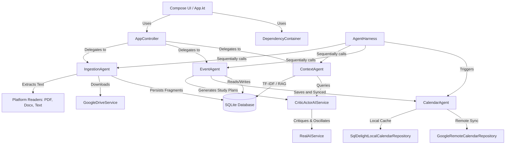

# Architectural Analysis: Class & Component Structure of CEF

This document provides a detailed structural analysis of the **College Executive Function (CEF)** codebase, detailing how classes are organized, how data flows, and where architectural boundaries lie.

---

## 1. High-Level Dependency Graph

The diagram below represents how core components depend on each other. Arrows point from the dependent class to its dependency:



---

## 2. Core Components Analysis

### 📡 AgentHarness (Autonomous Lifecycle Engine)
* **Responsibility:** Orchestrates background tasks, directory polling, and automatic pipeline flow.
* **Design Pattern:** Coordinator. It fetches watched directory lists from `Settings`, lists new files, drives them sequentially down the pipeline, and triggers calendar sync.
* **Evaluation:** High isolation. By running sequentially, it avoids LLM rate limits and isolates failure domains (an ingestion failure on one file does not halt synchronization of others).

### 📥 IngestionAgent (Document Ingest & Serialization)
* **Responsibility:** Accepts local paths, URLs, or Google Drive file references; extracts raw text utilizing platform-specific readers (PDF/Docx); categorizes content with AI; and persists them as `SourceEntity` and `FragmentEntity` in SQLite.
* **Design Pattern:** Facade / Pipeline Ingest.
* **Evaluation:** Decoupled from the UI via flows (`isBusy`, `error`, `sources`), making it highly testable.

### 📝 EventAgent (Event Generator & Task Decomposer)
* **Responsibility:** Core domain orchestrator. Translates syllabus fragments into calendar deadlines/exams, constructs study plans, decomposes long-term tasks into sub-steps, resolves calendar collisions programmatically using `CollisionResolver`, and pushes them to the `CalendarAgent`.
* **Evaluation:** Implements the core business rules. Uses `NormalizationService` to prevent duplicates and sanitize outputs. It is stateful, storing generated outcomes locally before calendar-push triggers.

### 🧠 ContextAgent (RAG & Semantic Retrieval)
* **Responsibility:** Performs document-specific intelligence. Extracts rules (policies, grading criteria) to persist as metadata, performs TF-IDF relevance ranking to retrieve key snippets across multiple documents, and runs Q&A queries.
* **Evaluation:** Excellent implementation of local RAG (Retrieval-Augmented Generation) without heavy dependency on vector databases. TF-IDF acts as a lightweight, cross-platform ranking mechanism.

### 📅 CalendarAgent (Master Repository Coordinator)
* **Responsibility:** Unifies local and remote database records. Functions as the gateway to the student's calendar. Coordinates local caching and online synchronization via the "Remote Gold Standard" pattern.
* **Evaluation:** Robust sync engine. Handles offline deletes, creates, and remote updates. Properly manages `SyncStatus` tags (e.g. `LOCAL_ONLY`, `SYNCED`, `DELETED_LOCALLY`).

### 🛡️ CriticActorAIService (Self-Correcting AI Decorator)
* **Responsibility:** Standardizes and verifies LLM output accuracy by comparing responses to original context, running self-correction iterations.
* **Design Pattern:** Decorator / Actor-Critic. Wraps another `AIService` implementation.
* **Evaluation:** Implements graph-based visited-state cycle detection. Dynamically terminates loops on convergence or oscillation, preventing infinite API token usage.

---

## 3. Data Transformations & Life Cycle

The following visual shows how raw text documents are transformed into active calendar events:

```
[Raw File (.pdf/.docx/.ics)]
            │
            ▼ (IngestionAgent via Local/Drive readers)
[SourceItem + SourceFragments]
            │
            ├──────────────────────────────────────────────┐
            ▼ (ContextAgent.analyzeSource)                 ▼ (EventAgent.extractDeliverables)
[Source Metadata (Grading/Rules)]                 [Raw Deliverable Events]
            │                                              │
            │                                              ▼ (NormalizationService)
            │                                     [Normalized Events]
            │                                              │
            │ (Context for planning)                       ▼ (CollisionResolver)
            └─────────────────────────► [Study Plan suggested blocks]
                                                           │
                                                           ▼ (CalendarAgent.saveEvent)
                                                [SQLite Calendar Cache]
                                                           │
                                                           ▼ (CalendarAgent.synchronize)
                                                [Google Calendar / External API]
```

---

## 4. Key Shortcomings & Design Recommendations

Based on the architectural review, here are the most critical opportunities for improvement:

### ⚠️ A. Database Dependency Leakage
* **Shortcoming:** `IngestionAgent` and `ContextAgent` directly refer to `AppDatabase` and execute raw SQLDelight queries rather than working through a dedicated repository abstraction.
* **Impact:** Tight coupling to SQLDelight. If the database engine changes or schema changes happen, these agents must be modified.
* **Recommendation:** Extract a `SourceRepository` interface to encapsulate operations on `SourceEntity` and `FragmentEntity`. Inject `SourceRepository` instead of `AppDatabase` directly into `IngestionAgent` and `ContextAgent`.

### ⚠️ B. Single-Threaded Settings access
* **Shortcoming:** Settings operations (like JSON serialization for watched folders in `AgentHarness` and preferences in `EventAgent`) block the calling thread.
* **Impact:** Large lists of watched paths or preference updates might cause UI micro-stutters.
* **Recommendation:** Run Settings serialization off-thread using `withContext(Dispatchers.Default)` inside repositories.

### ⚠️ C. Sequential vs. Parallel Ingestion Potential
* **Shortcoming:** `AgentHarness` processes files sequentially all the way down, including network and AI tasks. While safe, it can be slow if a user drops 10 files in a folder.
* **Impact:** Slower startup times if many new files are detected.
* **Recommendation:** Keep LLM calls sequential (due to rate limits and context-window sharing), but perform file reading and local database ingestion in parallel using Coroutines `async`/`await`.
